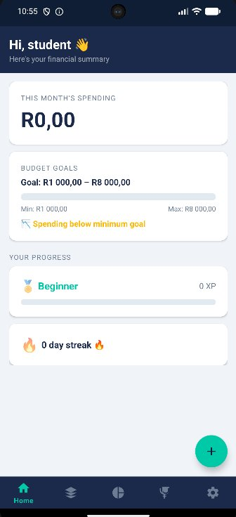
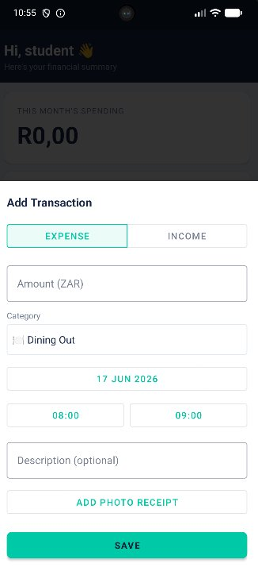
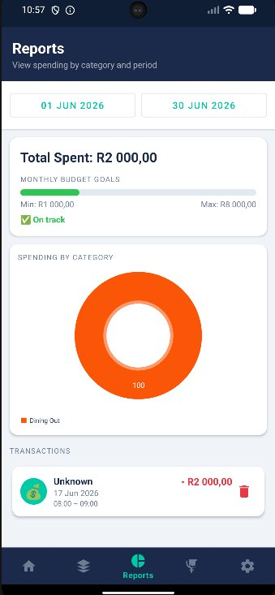
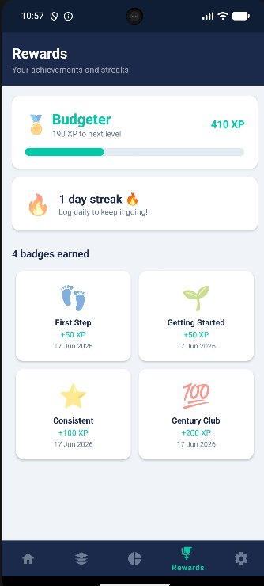

# 💰 BudgetMate

> **Your money, your rules** — a personal budget tracking Android app built with Kotlin.

---

## 📋 Table of Contents

- [About the App](#about-the-app)
- [Features](#features)
- [Own Features](#own-features)
- [Screenshots](#screenshots)
- [Architecture](#architecture)
- [Tech Stack](#tech-stack)
- [GitHub Actions (CI/CD)](#github-actions-cicd)
- [Automated Testing](#automated-testing)
- [Design Considerations](#design-considerations)
- [How to Build & Run](#how-to-build--run)
- [Video Demonstration](#video-demonstration)
- [References](#references)

---

## About the App

BudgetMate is an offline-first Android budget tracker that helps users log daily expenses, set monthly spending goals, and stay on track with gamified rewards and visual reporting. All data is stored locally on-device using Room — nothing ever leaves the phone, so your financial data stays private.

The app was designed with real South African users in mind: amounts are displayed in ZAR (South African Rand) and the interface is clean and mobile-friendly.

---

## Features

### 🔐 Authentication
- Local username and password registration and login.
- Passwords are **SHA-256 hashed** before being stored in Room — never stored in plaintext.
- Session is persisted with Jetpack DataStore so the user stays logged in between app restarts.
- A splash screen checks the session on launch and routes the user to either the home screen or the login screen automatically.

### 🏠 Dashboard
- Personalised greeting using the user's display name.
- Monthly spending total displayed in ZAR.
- Visual goal indicator (progress bar) showing how the month's spending compares to the user's minimum and maximum budget goals.
- Status label changes dynamically: ✅ On track → ⚠️ Approaching limit → 🚨 Budget exceeded.
- XP progress bar and streak counter visible at a glance.

### ➕ Add Transaction (Bottom Sheet)
- Modal bottom sheet — no full-screen navigation required.
- Fields: amount (ZAR), category (spinner), date (date picker), start time, end time, optional description, optional photo (camera or gallery).
- End time must be strictly after start time — validated before saving.
- Supports both **Expense** and **Income** transaction types via a toggle button.
- On save, the gamification engine fires automatically: XP is awarded, streaks are updated, and new badges pop up in a Snackbar.

### 🗂️ Categories
- Users can create custom categories with a name, emoji icon, hex colour, and optional monthly budget cap.
- Displayed in a 2-column grid with edit and delete options.
- Default categories (created on first login) are protected from deletion.
- Category names must be unique per user.

### 📊 Reports
- Date range selector using Android's native `DatePickerDialog`.
- Defaults to the current calendar month on first open.
- Transaction list filtered to the selected period, showing amount, category, date, time, and description.
- **Pie chart** (MPAndroidChart) showing spending broken down by category with the user's custom colours.
- Total spending for the selected period displayed below the chart.
- Individual transactions can be deleted directly from the list.
- Photo receipts can be tapped to open a full-screen zoomable viewer.

### 🎯 Goal Visualisation (Final POE Feature)
- The dashboard displays a progress bar that compares monthly spending against the user's minimum and maximum goals.
- The Reports screen pie chart shows spending per category and can be filtered by any date range — enabling users to visually assess their habits over time.
- Colour-coded feedback (green / amber / red) shows at a glance whether the user is within their budget.

### 🏆 Gamification (Final POE Feature)
The **Rewards** screen shows:
- **XP total** and current **level** (Beginner → Saver → Budgeter → Pro → Expert → Master).
- **XP progress bar** towards the next level.
- **Daily streak counter** — logging at least one transaction per day keeps the streak alive.
- **Badge grid** — badges are awarded automatically when milestones are reached.

**Badges available:**

| Badge | Emoji | Trigger |
|---|---|---|
| First Step | 👣 | First ever transaction |
| Getting Started | 🌱 | 10 transactions logged |
| Consistent | ⭐ | 50 transactions logged |
| Century Club | 💯 | 100 transactions logged |
| 3-Day Streak | 🔥 | 3 consecutive days of logging |
| Week Warrior | 🗓️ | 7-day logging streak |
| Monthly Master | 🏆 | 30-day logging streak |
| Goal Getter | 🎯 | Monthly spending goal met |

**XP rewards:**
- +10 XP per transaction saved
- +5 XP × streak bonus per consecutive day
- +50–300 XP per badge unlocked
- +100 XP for meeting the monthly goal

### ⚙️ Settings
- Set minimum and maximum monthly spending goals (ZAR).
- Goals saved persistently with Jetpack DataStore.
- Secure logout with confirmation dialog.

---

## Own Features

> The two custom features below were designed and implemented in addition to all module requirements. Please look out for these when reviewing the app.

### Feature 1: Income vs Expense Toggle
When adding a transaction, users can switch between **Expense** and **Income** using a Material toggle button group. Income transactions are stored with `type = "INCOME"` and excluded from spending totals and goal calculations — only expenses count toward the budget. This allows users to get a complete picture of their cash flow rather than just tracking spending.

**Where to find it:** Tap the ➕ FAB on the Dashboard → toggle between "Expense" and "Income" at the top of the bottom sheet.

### Feature 2: Receipt Photo Attachment with Full-Screen Viewer
Every transaction can have a photo receipt attached — either taken with the camera in real time or selected from the gallery. Photos are stored as file URIs on the device (using `FileProvider` for camera captures). In the Reports screen, any transaction with a photo shows a camera icon; tapping it opens a full-screen `TouchImageView` that supports pinch-to-zoom and pan gestures — ideal for reading receipt text on a small screen.

**Where to find it:** Add Transaction → tap "Add Photo" → take or choose a photo. In Reports, tap the photo icon on any transaction.

---

## Screenshots

> *(Add screenshots here after recording on a physical device)*

| Splash | Login | Dashboard |
|---|---|---|
|  |  |  |

| Add Transaction | Reports | Rewards |
|---|---|---|
|  |  |  |

---

## Architecture

BudgetMate follows the **MVVM (Model–View–ViewModel)** architecture pattern recommended by Google for Android development.

```
┌─────────────────────────────────────────────┐
│                    UI Layer                 │
│  Activities · Fragments · ViewBinding       │
└──────────────────────┬──────────────────────┘
                       │ observes LiveData
┌──────────────────────▼──────────────────────┐
│                ViewModel Layer              │
│  AndroidViewModel · viewModelScope          │
└──────────────────────┬──────────────────────┘
                       │ calls
┌──────────────────────▼──────────────────────┐
│               Repository Layer              │
│  TransactionRepository · GamificationRepo   │
│  AuthRepository                             │
└──────────────────────┬──────────────────────┘
                       │ uses DAOs
┌──────────────────────▼──────────────────────┐
│                  Data Layer                 │
│  Room Database · DAOs · Entities            │
│  DataStore (session + goals)                │
└─────────────────────────────────────────────┘
```

### Key design decisions

- **Single Activity** with Jetpack Navigation Component handling all fragment transitions.
- **Flow + LiveData** — Room queries return `Flow<T>`, collected in the ViewModel and posted to `LiveData` for the UI to observe. This means the UI automatically re-renders whenever the database changes.
- **Repository pattern** — all business logic and validation lives in repositories, keeping ViewModels thin.
- **Sealed classes for state** — `SaveState`, `AuthState`, and `TransactionRepository.Result` use sealed classes so every possible outcome is handled at the call site.
- **Coroutines** — all database operations run on `Dispatchers.IO` via `viewModelScope.launch`, keeping the main thread free.

---

## Tech Stack

| Library | Version | Purpose |
|---|---|---|
| Kotlin | 1.9.x | Primary language |
| Android SDK | 26 min / 34 target | Platform |
| Jetpack Navigation | 2.7.6 | Fragment navigation |
| Room | 2.6.1 | Local SQLite database with ORM |
| Jetpack DataStore | 1.0.0 | Persistent key-value preferences |
| ViewModel + LiveData | 2.7.0 | MVVM architecture |
| Coroutines | 1.7.3 | Async/background operations |
| Glide | 4.16.0 | Image loading and caching |
| MPAndroidChart | 3.1.0 | Pie chart for Reports screen |
| TouchImageView | 3.4 | Pinch-to-zoom photo viewer |
| Material Components | 1.11.0 | UI design system |
| KSP | — | Annotation processing for Room |

---

## GitHub Actions (CI/CD)

BudgetMate uses GitHub Actions to automatically build and test the app on every push to `main` and on every pull request.

The workflow file is located at `.github/workflows/build.yml`:

```yaml
name: Android CI

on:
  push:
    branches: [ "main" ]
  pull_request:
    branches: [ "main" ]

jobs:
  build:
    runs-on: ubuntu-latest

    steps:
      - name: Checkout code
        uses: actions/checkout@v3

      - name: Set up JDK 17
        uses: actions/setup-java@v3
        with:
          java-version: '17'
          distribution: 'temurin'
          cache: gradle

      - name: Grant execute permission for gradlew
        run: chmod +x gradlew

      - name: Run unit tests
        run: ./gradlew test

      - name: Build debug APK
        run: ./gradlew assembleDebug

      - name: Upload APK artifact
        uses: actions/upload-artifact@v3
        with:
          name: budgetmate-debug
          path: app/build/outputs/apk/debug/app-debug.apk
```

Every successful build produces a downloadable debug APK attached to the workflow run. This ensures the app compiles correctly on a clean machine — not just on the developer's computer.

> **References:**  
> - [Automated Build Android App — GitHub Marketplace](https://github.com/marketplace/actions/automated-build-android-app-with-github-action)  
> - [IMAD5112 GitHub Actions example](https://github.com/IMAD5112/Github-actions/blob/main/.github/workflows/build.yml)

---

## Automated Testing

Unit tests are located in `app/src/test/` and are run automatically by the CI pipeline.

### What is tested

- **`ExtensionsTest`** — verifies `isEndTimeAfterStart()` with valid, equal, and reversed times; verifies `toZar()` formatting; verifies `xpLevel()` returns the correct tier for boundary values.
- **`TransactionRepositoryTest`** — uses an in-memory Room database to test that valid transactions are saved, that `InvalidAmount` is returned for zero/negative amounts, that `InvalidTime` is returned when end time is not after start time, and that deleting a transaction removes it from the database.
- **`GamificationTest`** — verifies that XP is incremented after saving a transaction, and that the "First Step" badge is awarded after the first transaction.

Run tests locally with:

```bash
./gradlew test
```

---

## Design Considerations

### User Interface
- The app uses **Material Design 3** components throughout: `MaterialCardView`, `MaterialButton`, `TextInputLayout`, `BottomSheetDialogFragment`, `MaterialAlertDialogBuilder`.
- A custom teal colour palette (`#00C9A7`) was chosen to feel fresh and financial without being bank-corporate.
- The Bottom Sheet pattern for Add Transaction keeps the user on the Dashboard/Reports screen — no full-screen navigation break.
- The category grid uses the user's own chosen hex colour as the card accent, making it visually personalised.

### Privacy & Security
- All data is stored locally — BudgetMate has no network calls, no cloud sync, and no analytics.
- Passwords are SHA-256 hashed using `java.security.MessageDigest` before being written to Room.
- Camera photos are stored in the app's private external files directory and shared via `FileProvider` — they are not accessible by other apps.

### Offline-first
- Because everything is local Room + DataStore, the app works fully offline. There is no loading spinner waiting for a network response.

### Accessibility
- All interactive elements have content descriptions.
- Snackbar messages are used for feedback rather than Toast (better screen reader support).
- Font sizes follow Material default scale.

### Code quality
- Every class, function, and non-obvious block has a KDoc or inline comment explaining its purpose and design decision.
- `Log.d / Log.i / Log.e / Log.w` statements are placed at every significant action — database writes, navigation events, validation failures — to aid debugging.
- ViewBinding is used everywhere; `findViewById` is never called.

---

## How to Build & Run

### Prerequisites
- Android Studio Hedgehog (2023.1.1) or later
- JDK 17
- Android device or emulator running API 26+

### Steps

```bash
# 1. Clone the repository
git clone https://github.com/<your-username>/BudgetMate.git

# 2. Open in Android Studio
File → Open → select the BudgetMate folder

# 3. Let Gradle sync

# 4. Run on a device or emulator
Run → Run 'app'
```

The built APK is also available as an artifact from the latest GitHub Actions run under **Actions → Android CI → build → budgetmate-debug**.

---

## Video Demonstration

> 📹 **[Watch the demo on YouTube](https://www.youtube.com/watch?v=YOUR_VIDEO_ID)**  
> *(Replace this link with your unlisted YouTube URL before submission)*

The video demonstrates:
1. Launching the app on a physical Android device
2. Registering a new account and logging in
3. Creating custom categories with emoji icons and colours
4. Adding expense and income transactions with date/time pickers and a photo receipt
5. The Dashboard goal indicator updating in real time
6. Navigating to Reports and filtering by date range — showing the pie chart
7. Earning XP and a badge after logging transactions
8. The Rewards screen showing level, streak, and badge grid
9. Setting minimum and maximum budget goals in Settings
10. Logging out and back in to confirm session persistence

---

## References

- Google. (2024). *Android Developers Documentation*. https://developer.android.com/docs
- JetBrains. (2024). *Kotlin Documentation*. https://kotlinlang.org/docs/
- Google. (2024). *Jetpack Room*. https://developer.android.com/training/data-storage/room
- Google. (2024). *Jetpack Navigation Component*. https://developer.android.com/guide/navigation
- Google. (2024). *Jetpack DataStore*. https://developer.android.com/topic/libraries/architecture/datastore
- PhilJay. (2024). *MPAndroidChart*. https://github.com/PhilJay/MPAndroidChart
- Bumptech. (2024). *Glide Image Loading Library*. https://github.com/bumptech/glide
- MikeOrtiz. (2024). *TouchImageView*. https://github.com/MikeOrtiz/TouchImageView
- GitHub. (2025). *Automated Build Android App with GitHub Action*. https://github.com/marketplace/actions/automated-build-android-app-with-github-action [Accessed 05 November 2025]
- IMAD5112. (2025). *GitHub Actions example workflow*. https://github.com/IMAD5112/Github-actions/blob/main/.github/workflows/build.yml [Accessed 05 November 2025]

---

*BudgetMate — developed as part of the IMAD5112 module, IIE / Varsity College, 2025.*
